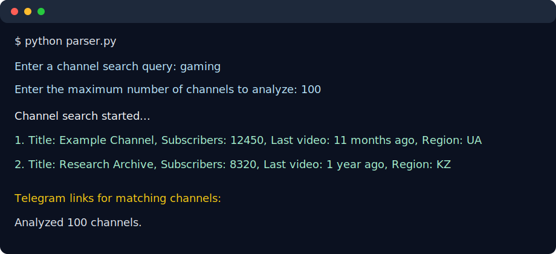

# ChannelFreeze

Find inactive YouTube channels based on search queries and predefined filtering criteria.

ChannelFreeze helps discover abandoned or inactive YouTube channels by analyzing subscriber count, upload activity and channel metadata.



---

## Features

- 🔍 Search YouTube channels by keyword
- 📅 Detect inactive channels based on the latest uploaded video
- 👥 Filter channels by subscriber count and minimum video count
- 🌍 Search across the default `RU`, `UA`, `BY`, and `KZ` regions
- 📢 Print Telegram links found in matching channel descriptions
- 🚫 Skip gambling-related channels based on channel and latest-video descriptions
- 🔄 Rotate YouTube API keys when quota is exceeded
- 💾 Store previously analyzed channel IDs to avoid duplicates between runs

---

## Technologies

- Python
- YouTube Data API v3

---

## Setup

1. Create and activate a Python environment:

   ```bash
   python3 -m venv .venv
   source .venv/bin/activate
   ```

2. Install dependencies:

   ```bash
   pip install -U pip
   pip install -r requirements.txt
   ```

3. Create a private API key config:

   ```bash
   cp api_keys.example.json api_keys.json
   ```

4. Add one or more YouTube Data API v3 keys to `api_keys.json`.

---

## Usage

Run the parser:

```bash
python parser.py
```

The script prompts for a search query and the maximum number of channels to analyze.

Example:

```text
Enter a channel search query: gaming
Enter the maximum number of channels to analyze: 100
Channel search started...
1. Title: Example Channel, Subscribers: 12450, Last video: 11 months ago, Region: UA
```

Current default filters:

- subscriber count between `2,000` and `1,000,000`
- at least `10` uploaded videos
- no uploads in the last `6` months
- regions: `RU`, `UA`, `BY`, `KZ`

The script stores processed channel IDs in `seen_channels.json` to avoid duplicate analysis between runs.

## Repository layout

```text
.
├── parser.py
├── requirements.txt
├── api_keys.example.json
└── docs/screenshots/
```

---

## Private files

The following local files are intentionally ignored by Git:

- `api_keys.json`
- `seen_channels.json`
- `.DS_Store`
- virtual environments and IDE settings

---

## Purpose

This project was built to automate the discovery of inactive YouTube channels for outreach and research purposes.

---

## Future improvements

- Export results to CSV
- GUI interface
- More advanced filtering
- Better reporting
